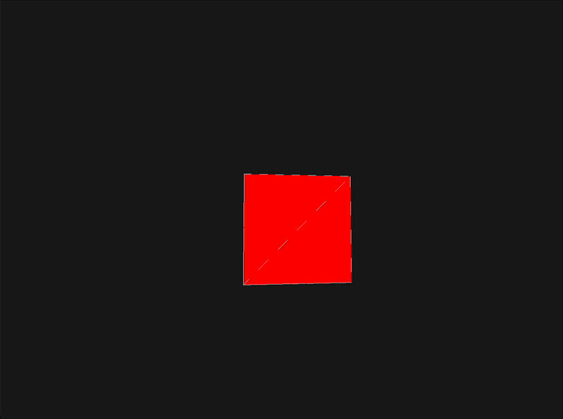

# LWJGL OpenGL 學習專案

使用 Java、LWJGL 3 與 OpenGL 3.3 從零開始學習 3D 圖形渲染。



⸻

## 專案目標

透過實際撰寫程式理解：

* OpenGL 渲染流程
* Shader 運作原理
* Mesh 與 Vertex 概念
* Camera 系統
* 座標系統

⸻

## Camera 系統

* FPS 第一人稱視角
* WASD 移動
* Space 上升
* Shift 下降
* 滑鼠控制視角
* Yaw 水平旋轉
* Pitch 垂直旋轉
* ESC 釋放滑鼠
* 左鍵重新鎖定滑鼠

⸻

## 控制方式
```text
按鍵	功能
W	前進
S	後退
A	左移
D	右移
Space	上升
Left Shift	下降
滑鼠	旋轉視角
ESC	釋放滑鼠
左鍵	重新鎖定滑鼠
```

⸻

## 座標系統

本專案採用右手座標系：

```text
       Y+
       ↑
       |
       |
       |
       O──────→ X+
      /
     /
   Z+
```

軸向定義

* X：左右方向
* Y：高度方向
* Z：前後方向

⸻

## OpenGL 渲染流程

```text
Mesh
 ↓
Model Matrix
 ↓
World Space
 ↓
View Matrix
 ↓
Projection Matrix
 ↓
Vertex Shader
 ↓
Fragment Shader
 ↓
螢幕畫面
```

⸻

## 技術棧

* Java
* LWJGL 3
* OpenGL 3.3
* GLFW
* JOML
* Maven
